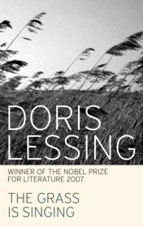

# The Grass Is Singing <kbd>v3.3.1</kbd>

  

## Creator
Doris Lessing

## Description

How had all this started? What sort of woman had Mary Turner been before she came to the farm and had been driven slowly crazy by heat, loneliness and poverty? He tried to think clearly, to get a picture of what had really happened.
In southern Africa in the 1940s, the whites are in control. They control through fear – and they must stay in control. So when a white woman is murdered by her black servant all the whites agree: the law must take its course. The case must be simple and quick – without too many questions.
But there are questions, and people are asking them. How did Mary Turner lose control? Why did the servant murder her? How could a servant even think of it?
The answers are not simple. They are as difficult and painful as Mary Turner’s life itself – a life in a place where she was never meant to be…

