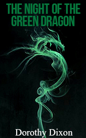

# The Night of the Green Dragon <kbd>v3.2.1</kbd>

  

## Creator
Dorothy Dixon

## Description

Howard woke up from a terrible nightmare. In reality, he got into a bigger one. He was at the hospital with a broken head. The policemen called him Mr. Black. But Howard knew definitely that it wasn't his name. Unfortunately, he could not remember his right name. He lost his memory due to the injury. The police did not believe him. They started questioning him immediately. Howard was accused of illegal penetration into the house, murder of an old woman and stealing a green dragon. The man remembered nothing except the red eyes of the mysterious dragon and blood. He clearly understood that he was not a criminal. He was a victim. Howard runs away from the hospital at night. He has to regain his memory and prove that he is not guilty.

