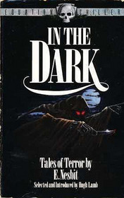

# In the dark <kbd>v3.2.1</kbd>

  

## Creator
E. Nesbit

## Description

At school my friend Haldane and I hated a boy called Visger. When we did something bad, he always told the teacher. One day we stole some cherries from a tree. He as always told this to teacher. We were very amazed cause nobody saw us, so we asked him how we could know about our stealing. He answered to us that he just know it, maybe felt or something like this. It was very weird. Nevertheless, Haldane and I grew up. Visger became a vegetarian and never drank alcohol. He also became Sir George Visger.
When we all left Oxford University, I went away abroad. Just one year later I came back and wanted to see me dear old friend. He was always happy, kind, and honest. I wanted to see the smile in his blue eyes again and hear his happy laugh, so I went to visit him in London. But and this time he even did not smile. He was miserable, his face was pale and he looked weak and ill.

