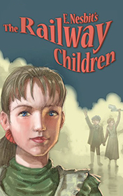

# The Railway Children <kbd>v3.3.1</kbd>

  

## Creator
E. Nesbit

## Description

This story is written in the third person plural. One day some people came to one happy family and took their father away. The children did not understand what had happened. Their mother could only tell them that father would be away for some time. The family had to leave their native home in London. The mother and three children Bobbie, Peter and the youngest Phyllis moved to a new house near the railway in Yorkshire. The childish attention was fully attracted by the railway station. They had many exciting adventures. The curious children even made a friend with an old man, who rode a 9:15 train every day. This man helped the family so much that Bobby decided to ask him for help. The girl found out their father was accused of spying. 

