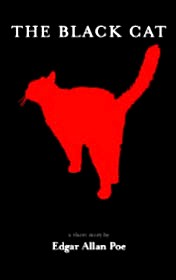

# Black Cat <kbd>v3.2.1</kbd>

  

## Creator
Edgar Allan Poe

## Description

The narrator tells us that from the early age he has loved animals. He and his wife have many pets, including a large black cat named Pluto. This cat is especially fond of the narrator and vice versa. Their mutual friendship has been lasting for several years, until the narrator had become an alcoholic. One night, after coming home intoxicated, he believed the cat was avoiding him. When he tried to seize it, the panicked cat has beaten the narrator, and in a fit of rage, he has seized the animal and cut out the cat's eye.

