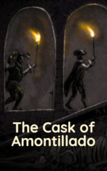

# The Cask of Amontillado <kbd>v3.3.1</kbd>

  

## Creator
Edgar Allan Poe

## Description
This is the story by the famous writer Edgar Allan Poe. It is this author who is considered to be the progenitor of such a popular genre in literature as horror fiction. Even Howard Lovecraft was inspired by his books. This story was published in the collection at the end of the nineteenth century. The main character's name is Montezor. At the beginning of the story, he brags about how he got even with a mean nobleman, avenging for all bitter offences. He planned to commit a murder during the carnival: the people around would be drunk and cheerful, everyone would be dancing - no one would notice the real crime. Everyone would decide it as a part of the fun. He lured the foe into his mansion to show a collection of wines in the cellar. Further, Montezor thought up a particularly exquisite crime, which no one expected.
