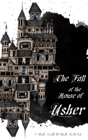

# The Fall of the House of Usher <kbd>v3.3.1</kbd>

  

## Creator
Edgar Allan Poe

## Description

The narrator has receives an odd letter from an old friend, Roderick Usher, requesting his presence. The contents of the letter revealed that Usher is suffering from numerous illnesses, both mental and physical.
Roderick Usher and his twin sister Madeline are the last two Ushers in a long line of Ushers whose family tree has never branched. The phrase "House of Usher" refers to both the house and the family. Roderick excitedly welcomes the narrator. They are talking. The narrator learns that Roderick's sister is near death. The narrator has been spending several days attempting to cheer up Roderick, but it is unable. Roderick suggested that this house is making him sick, something which the narrator has already suspected.

