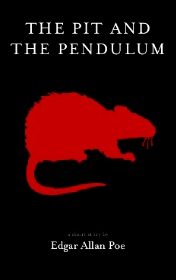

# The pit and the pendulum <kbd>v3.2.1</kbd>

  

## Creator
Edgar Allan Poe

## Description

A man is in a room without light. He attempted to figure out his rooms shape, and ended up almost falling down a pit. Later he was drugged by the food the captors have given him. He has ended up strapped to a table with a big pendulum holding a giant blade that was slowly descending. In order to save himself, he took the beef they have allowed him to have as a last meal, and smothered his bindings in their juices, prompting the rats to eat them. He was released just before the blade would have killed him, only the walls were moving towards the centre pit. He would have fallen in but a man had grabbed his arm. That man was an officer in charge of releasing all the prisoners at the end of the Inquisition.

