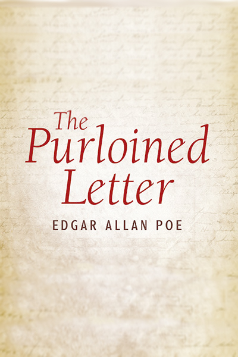

# The Purloined Letter <kbd>v3.3.1</kbd>

  

## Creator
Edgar Allan Poe

## Description

An unnamed narrator tells the story as he discusses his most amazing investigation with the famous Parisian amateur detective Auguste Dupin. At this point, they are joined by Monsieur G, the Prefect of Police. A secret letter containing incriminating information was stolen from a young lady. The only known fact was that the letter was stolen by a Minister D. The Minister was in the room and when he saw the letter he substituted it with another of no importance. The Prefect was sure that the Minister still had the letter and was hiding it. The Prefect admitted that the police made ​​a search of the Home Minister, but had found nothing. They had even looked behind the wallpaper and under carpets and had inspected chairs with microscopes – but without result. Dupin’s answer was that they had searched, but not carefully.

