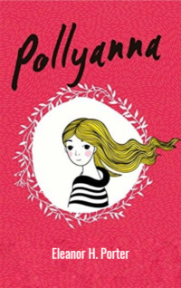

# Pollyanna <kbd>v3.3.1</kbd>

  

## Creator
Eleanor H. Porter

## Description
Pollyanna is eleven years old. She is an orphan. Despite this, the girl is an incorrigible optimist. Long ago, her mother married a poor priest and left the country. The couple died. Now Pollyanna has only an aunt. Aunt Polly decides to take her niece due to a great sense of duty. The woman is maximally unemotional, cynical and does not believe in love. She convinced herself she does not need sincere emotions. The woman puts her niece in a small and uncomfortable room. Still Pollyanna enjoys a pleasant view from the window. The girl is unpretentious, joyful and always in motion. First Polly is confused. Then she begins to get used to this philosophy of the little cheerful girl. Polly realizes that this is exactly what is missing in her life. 
