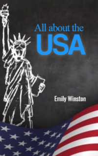

# All about the USA <kbd>v3.2.1</kbd>

  

## Creator
Emily Winston

## Description
'All about the USA' is an educational book by Emily Winston. It contains interesting stories and facts about places or people that made their mark in history. The pages of this book will create a fascinating journey to Grand Canyon for you. You will see the Niagara Falls. There are many other beautiful places in America to visit. There are also some unknown traditions and sights of the USA. The book contains many stories and legends. Lovers of secrets will love such stories. Each page of this book allows you to learn something new. This country has many achievements. The book provides an opportunity to meet talented people who have changed the world. And it is interesting to read about how Windows, Apple and other famous companies were created.  
