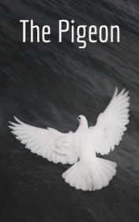

# The Pigeon <kbd>v3.2.1</kbd>

  

## Creator
Eona Macnicol

## Description
Strong people can easily take care of themselves. They are able to solve their own problems, and a little bit more - to help loved ones, and just people who need it. This is one of the nice possibilities of a really strong person. But what can the weak people do? What if it is a child, a sick person or an animal? And if it's just a small bird? Jan found this bird at the window of his bedroom, on a small ledge outside. The pigeon was wounded. It could not fly and clearly had to die. Ella offered Jan to give the bird to a person who had her own dovecote, but Jan refused. This is his bird and he must take care of it by himself. Ella did not understand him, but agreed. The pigeon felt worse than a week ago. Earlier it tried to fly, but now it was just lying without   moving. But Jan was not going to change his mind.
