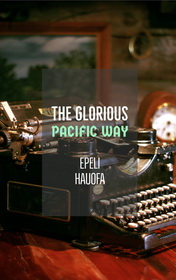

# The Glorious Pacific Way <kbd>v3.3.1</kbd>

  

## Creator
Epeli Hauofa

## Description
In the South Pacific, folk tales, legends and stories are not forgotten, as in the rest of the world. There they are still remembered and transmitted from person to person. In the modern world, such stories lost their value, but not in Ole's house. The guy loves these folk tales and writes them down to save for the next generations. This is hard and slow work. He dreams of a typewriter. Once Ole felt that God wanted him to go on writing. That is why he does not give up. Some rumours of this reach the official Mr. Harold. Mr. Harold is quite interested. He even invites Ole to the party at an expensive hotel, where he praises the guy for his effort. Finally Ole can get money for help in his work. But everything is not so simple as it seems.
