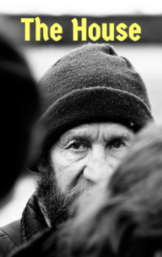

# The House <kbd>v3.3.1</kbd>

  

## Creator
Erica N Robinson

## Description
Sometimes life suddenly deteriorates. At one point, everything goes as usual, and then it collapses. A person can quarrel with friends, lose a lucrative job and even a house. He can be forced to live on the street. He starts drinking too much alcohol, stops bathing, shaving and looking after himself. Who would agree to give such a person a second chance? Very few. But Nan - the seller of fruit - is a woman like that. Sonny had an idea, but he wasn't sure that Nan would agree. He built a house - it was large enough for two families to live in it with complete comfort. He thought that he should let his ex-wife and two children live in this house. Nan was outraged, but Sonny tried to explain that it was necessary for the children. He was sure that his children should not live on the streets and sell drugs.
