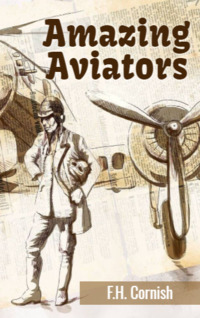

# Amazing Aviators <kbd>v3.2.1</kbd>

  

## Creator
F.H. Cornish

## Description
This book is a collection of stories about the most famous aviators in history. These people literally helped humanity to conquer the skies. Probably, it is thanks to them we can use regular air transportation nowadays. The history of aviation begins with Joseph-Michel Montgolfier. He was the man who pioneered aviation. Louis Bleriot, first to cross the sea in an aeroplane. He covered the distance from France to England. Charles Lindbergh, Amelia Earhart, Amy Johnson are no less famous. They also had outstanding achievements. All of them made an invaluable contribution into the development of aviation.The life stories of such people are extremely interesting and definitely deserve attention. 
