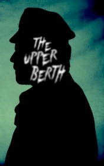

# The upper Berth <kbd>v3.3.1</kbd>

  

## Creator
F. Marion Crawford

## Description

The man Brisbane tell the history, which is happened with him, when he had to travelling on his favourite ship named “Kamtschatka”. Ofcourse, after when you’ll have known this story, you’d understand why Brisbane don’t sailing on it anymore. But at that time, in hot summer he came on his cabin number 105, he was going to America. Our hero noticed strange behavior of the steward. And Brisbane thought that steward was drunk. In this cabin he had a companion. But he went out the cabin at night with screaming and anybody didn’t saw him after it. Next day shep’s doctor invited Brisbane to live in his room, when he inquired about the number of his room. And told to Brisbane that three man who lived there were dead. Brisbane decided to consider this mystery.

