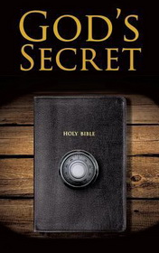

# God's Secret <kbd>v3.3.1</kbd>

  

## Creator
Foreman Peter

## Description
People often want to know what will happen after they die. They say if a person is good, he or she will definitely go to heaven. So if you are kind and polite, you have nothing to worry about. But what if our afterlife destiny doesn't depend on our behavior on earth at all? What if God keeps a secret from us? The main character of this story never smoked, drank or gambled during his life. He never hurt anyone in the hope of getting to heaven. But his dream is ruined when the man dies and finds out that his future is just a matter of luck. Will he still be able to get a place in heaven? And most importantly, is heaven as good as it seems? This story challenges our traditional beliefs and offers an alternative vision of what the afterlife is like.
