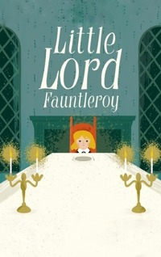

# Little Lord Fauntleroy <kbd>v3.3.1</kbd>

  

## Creator
Frances Eliza Burnett

## Description
Cedric is only seven years old. He lives with his mother on the outskirts of New York. Their family is not very wealthy. But one strange day everything changes. Cedric becomes the sole heir to the famous English aristocrat. This is his grandfather. The earl of Dorincourt hates the boy's mother for her American origin. This old man is a misanthrope and hates lots of people. Still Cedric manages to find a common language with him. The boy firmly believes that deep inside his grandfather is kind. Gradually, the old man makes contact with Cedric. Now the earl does not want to lose this bond with his grandson. Perhaps he has become sentimental. Or perhaps, a seven-year-old boy is the only one who can awaken something human in the old aristocrat. 
