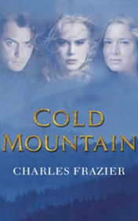

# Cold Mountain <kbd>v3.3.1</kbd>

  

## Creator
Frazier Charles

## Description

This is a romantic love story about fidelity, friendship and a ridiculous cruelty of war. Ada is a beautiful daughter of a priest. One day she meets a silent and thoughtful Inman. The civil war starts and their affair is suspended. Inman goes to the front. He promises to come back with the victory. The years are passing but the war isn’t stopping. Ada is waiting for her beloved. Is he alive? Does he remember her? The young woman hardly copes with the difficulties of a daily civil life. The memories about Inman, love and expectations give her strength to live. Inman realizes that his beloved Ada is exhausted, her heart is torn. She asks him to come back. Inman leaves the front and starts going home to cold Mountain and becomes a deserter. 

