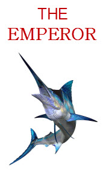

# The Emperor <kbd>v3.3.1</kbd>

  

## Creator
Frederick Forsyth

## Description
Every year, the bank rewarded two of its employees. The two employees who had worked the hardest were given a reward. The bank gave the two employees and their families a holiday. This year, 1977, the reward was a holiday in Mauritius. Mauritius is a small island in the Indian Ocean. Many tourists visit Mauritius. And many of them enjoy water-sports and sea-fishing. Edna Murgatroyd had come to Mauritius with her husband. John Higgins was not married тАУ he was travelling alone. The Murgatroyds had been married for twenty-five years and Edna was never happy about anything or anybody. The days passed quickly. Every day, the Murgatroyds did the same things. They sat on the beach. Edna sat under a sun umbrella and read romantic novels. Roger did what his wife told him to do. But at last days of their holiday something happened that changed things that were the same for many years.
