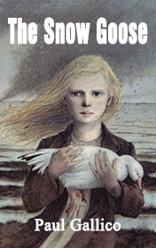

# The Snow Goose <kbd>v3.2.1</kbd>

  

## Creator
Gallico Paul

## Description

Very often God gives a man a nice appearance. But the man’s heart becomes coarse apart of this generous gift. Beauty is not the same as inner world. An external ugliness can hide a heart, which holds love to the whole world without any borders. The author of this story introduces such a human to us. His name is Phillip. He has a hunchback with mutilated limbs. The man lives in a quite location. He is an artist. He paints the pictures of nature. Especially he likes painting birds. He learned all of them. Phillip lives in a lighthouse and he often chases down the hunters, who are looking for the birds. The local people are not very fond of Phillip because of his ugliness. But he is said to be a good healer. One day somebody knocked on his door. There was a girl covered with blood. She was holding an injured goose in her hands.

