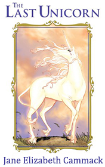

# The Last Unicorn <kbd>v3.3.1</kbd>

  

## Creator
Gammack J. E.

## Description

This unbelievable story happened to little Megan on a famous Scottish island Skye with a shape of a butterfly. This place has an old history, beautiful nature and varied fauna. Megan had to leave London with its traffic and noise according to the prescription of her mother's doctor. She had been a lonely child. Megan had spent six months in London and hadn't found any friends. Other girls from her school hated her and sent disgusting messages. And now she came to this marvelous island where her uncle lived. On the way to her uncle Megan saw a unicorn which disappeared as quickly as it appeared. Perhaps this trip won't be so sad and frustrating as she had imagined before? Will she be able to find something special for herself? 

