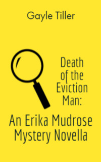

# Death of the Eviction Man <kbd>v3.2.1</kbd>

  

## Creator
Gayle Tiller

## Description
Erica is not doing well. The woman is not a very successful private detective. She lives in Northern California and works from her own apartment, as she was forced to close the office due to financial problems. She also keeps her unemployed boyfriend, because he was fired from work in Silicon Valley - he worked in the field of high technology. Unfortunately, he could not achieve his goals. Moreover, one former client pursues Erica in order to get her money back. The whole situation looks rather gloomy. But once Lisa Pullroy addresses Erica. She wants the detective to find the killer of her husband, Calvin. He was known for evicting tenants who owed money. That man had a lot of enemies. And this new case gives impetus to Erica's career.
