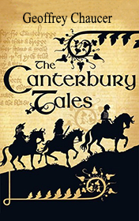

# The Canterbury Tales <kbd>v3.2.1</kbd>

  

## Creator
Geoffrey Chaucer

## Description

Geoffrey Chaucer created this book in 1387. At that time the religion was the most important thing for European people. It was very popular to go on pilgrimages. It means travelling to famous Christian cities to be near to God. People said their prayers and asked for well-being or repented about something and supplicated for help. A group of people went on a pilgrimage to Canterbury, a town in England. Their aim was Canterbury Cathedral. At the beginning of their journey one member of the group suggested a game to entertain everybody. All of them had to tell one story. The best story would win a prize at the end of the journey. Everyone had something he wanted to share. The stories were very different. You'll hear much interesting from a Knight, a Clerk, a Merchant, a Franklin and a Pardoner.

