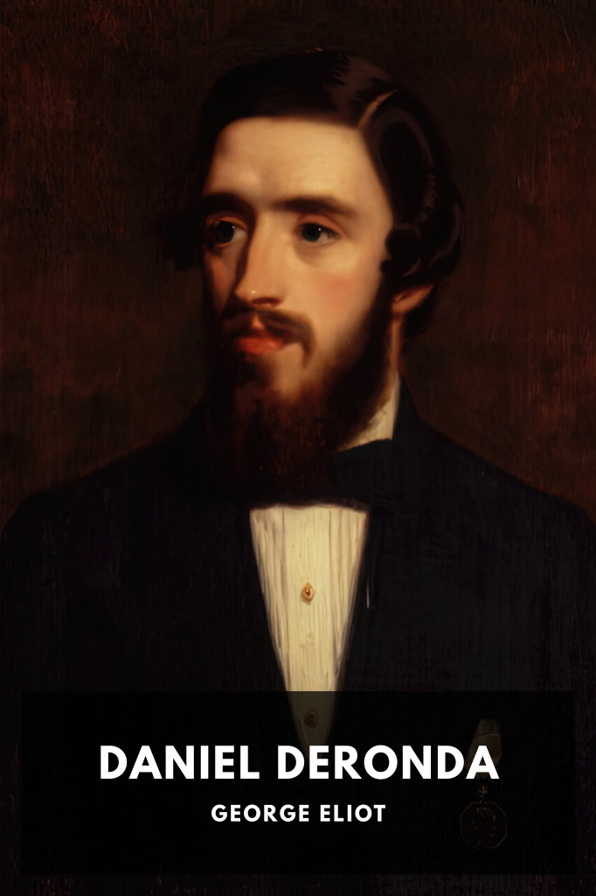

# Daniel Deronda <kbd>v3.3.1</kbd>

  

## Creator
George Eliot

## Description
An orphaned young man raised as an aristocrat’s nephew feels a moral obligation to assist others, and in doing so eventually discovers his true parentage and culture.
