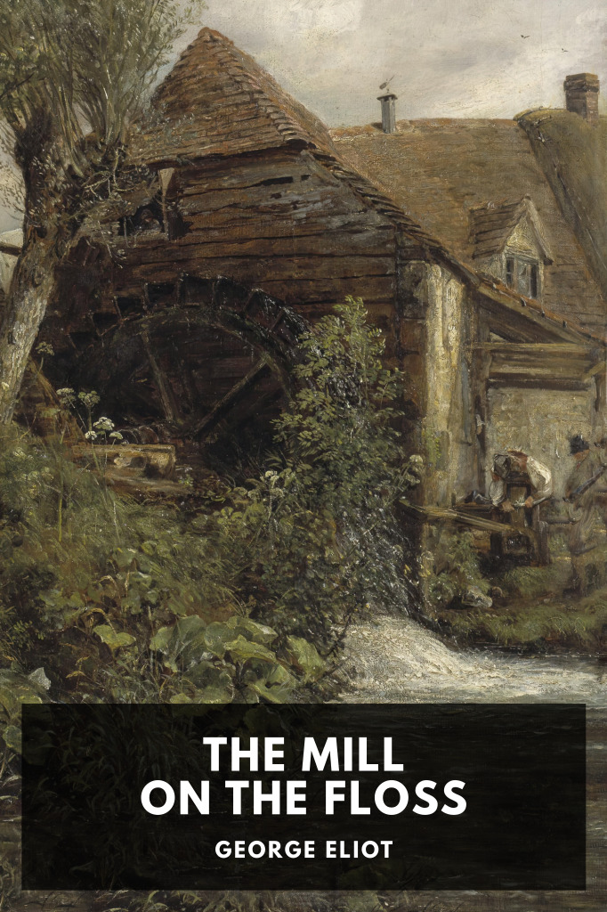

# The Mill on the Floss <kbd>v3.2.1</kbd>

  

## Creator
George Eliot

## Description
The lives of two young people are thrown into disarray when their father, the owner of a mill, is bankrupted by an unwise legal dispute.
