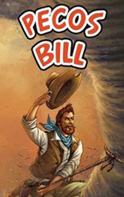

# Pecos Bill <kbd>v3.2.1</kbd>

  

## Creator
George Gibson

## Description
Bill was born in the 1800's as the youngest child in the family. When he was two years old, his parents decided to move to the West of America. It seemed a good idea. The family loaded all their belongings into a covered trailer. A difficult journey began. They rode through hot plains, dense forests and mountains. The family saw a lot of interesting things and met a tribe of friendly Indians. Already in Texas, little Bill fell out of the trailer. No one noticed. Later everybody searched for him for a long time - in vain. Bill's relatives decided to continue the journey without their youngest child. The little baby was able to survive. He find a coyote cave. Some wild animals started protecting him. The boy lived with the predators for about twenty years.
