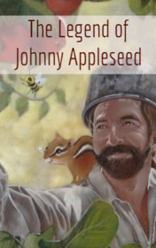

# The Legend of Johnny Appleseed <kbd>v3.2.1</kbd>

  

## Creator
George Gibson

## Description
Johnny Appleseed was born near Boston. When he was a child, he often played in the woods and talked to the animals. They were his friends. He loved them very much. The boy's family was extremely religious. So Johny's first book was the Bible. But the boy also loved reading Aesop's Fables. In adolescence, Johnny worked as a missionary and brought many Indians to Christianity. They became his friends too. At the age of 26, he saw an angel in a dream. The angel ordered him to go throught America and plant apple seeds. Johnny was surprised, but happily agreed. He was a decent guy and loved helping people. This seemed a good deed to him. He took a large bag of apple kernels, a Bible, and Aesop's Fables. That was all Johny needed on the way.
