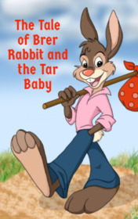

# The Tale of Brer Rabbit and the Tar Baby <kbd>v3.3.1</kbd>

  

## Creator
George Gibson

## Description
Each summer is hot in the south of America, but this summer turned out to be very hot. The August was warmer than usual. All the animals on the plantation were having a rest. Fox was sitting quietly in the shade of a huge tree and drinking cold lemonade. Everything was great, except one thing. It was Rabbit. Fox did not like Rabbit. However, no one loved him. This guy was a lover of dubious jokes and could play a trick on anyone. Before his appearance, the plantation was a quiet, cozy place, but Rabbit came out of nowhere and tricked Fox, Bear, Turtle and  Wolf. His best joke was a scarecrow of resin in a straw hat. He put it in front of Fox's house. Of course, Fox stuck to the man of resin. Since that time, he had been disliking Rabbit.
