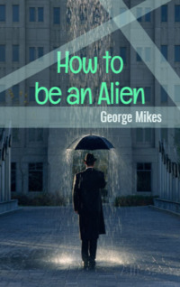

# How to be an Alien <kbd>v3.2.1</kbd>

  

## Creator
George Mikes

## Description
Great Britain is very different from the rest of the world. It consists of four countries and each of them has its own unique and ancient culture. Irish and British differ very much and do not love each other. And Scotland and Wales are two more countries that donated kilt, bagpipes and many other interesting items to the world. They say that poor people put on their best clothes and go to the city at the weekend in Europe. In England, it is the opposite - the rich dress poorly. In Europe, people rarely talk about the weather, but in England this is a tradition. Real Englishmen talk about the weather a few dozen times a day. In Europe, people value their friends. In England, people communicate politely, but maintain distance. The Englishman has very few close friends.
