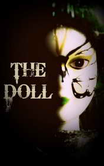

# The Doll <kbd>v3.3.1</kbd>

  

## Creator
George

## Description

Sometimes one little thing can change the whole life. This story is about a true love. We will learn how poor and painful our life can be without love. There is a doctor in the centre of the novel. He is a real professional and good-looking man. He works and lives alone in a flat in the centre of London. It was a usual day, when he saw an incredible doll in the shop not far from his house. The doll was a hand-made thing, made with much love and accuracy. It impressed the doctor and he bought this doll for his niece. Later he got a call. One woman asked him to come and examine her ill niece. Her niece turned out to be the creator of these wonderful dolls. The doctor had recently bought one of her works. This young woman was ill. Many years ago she was injured in a car accident. Now she is alone and has no meaning of life. She needs to love and be loved by someone.

