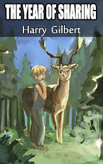

# The Year of Sharing <kbd>v3.3.1</kbd>

  

## Creator
Gilbert Harry

## Description
Have you ever wondered what will be with our planet in five hundred years? How will the infrastructure develop? What will happen to the nature? Richard lives in the world, which is significantly different from ours. They live in villages instead of cities. They use bicycles as transport. In the forests, there are only wild animals. Every inhabitant of this world must bring his Year of Sharing when he reaches the age of twelve. It means the child will go to the wild forest to live alone. This term lasts for a whole year. They do it for learning to share the world with the animals. This way every person finds a new family in the wild. Tomorrow Richard is going somewhere deep into the forest. He cannot even imagine how many dangers are waiting for him there.
