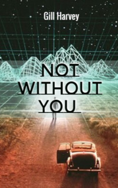

# Not Without You <kbd>v3.3.1</kbd>

  

## Creator
Gill Harvey

## Description
There is the end of the twenty-first century on the streets. High-tech cities are filled with people. Each resident wears a special chip under his skin, which allows him to use all modern technologies. The outside world froze on the verge of a great disaster. Now it is contaminated.  It is abandoned by most of the inhabitants, who once left it for their own safety. Sala is the main character of this story. The girl has been living in one of such high-tech cities since the age of ten. In this world of the future, virtual simulations are created in order to replace many social areas. Sala works in a laboratory with her friends. It is an ordinary evening now. But something very unusual is to happen soon. 
