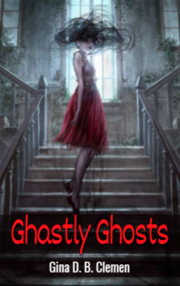

# Ghastly Ghosts <kbd>v3.2.1</kbd>

  

## Creator
Gina D. B. Clemen

## Description
People talked about ghosts and demons hundreds of years ago. They often remember about these creatures today. But today, as hundreds of years ago, people do not know anything about ghosts, only urban legends and horror stories. Today there are many scientists who are trying to explore places with paranormal activity, take pictures of ghosts and figure out what they really are. Some of them use sophisticated instruments to find out if ghosts affect the laws of physics. Others come with ordinary cameras. They are trying to make a good photo of the otherworldly entity and make money on it. There are even special departments in universities that deal exclusively with spirits, ghosts and demons. They are trying to find the answer to a single question. What are ghosts? Are they really spirits of the dead? 
