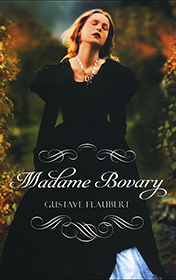

# Madame Bovary <kbd>v3.3.1</kbd>

  

## Creator
Gustave Flaubert

## Description
Charles Bovary graduates from the college. He is not a very smart person, so his mother helps him to get a doctor's job in a provincial French town. Thanks mother's efforts, he marries a local widow. The woman is over 40. She is unattractive, but wealthy. One day Charles goes to examine another patient - a local farmer. He meets a farmer's daughter Emma, who is very pretty. The doctor feels a desire towards the young girl. After his wife's death, Charles starts communicating with Emma and after a while decides to ask for her hand. Her father gives a consent and arranges a magnificent wedding. But when the young couple begins to live together, Emma suddenly realizes her true feelings. She does not love Charles. She is unaware of what real love is.
