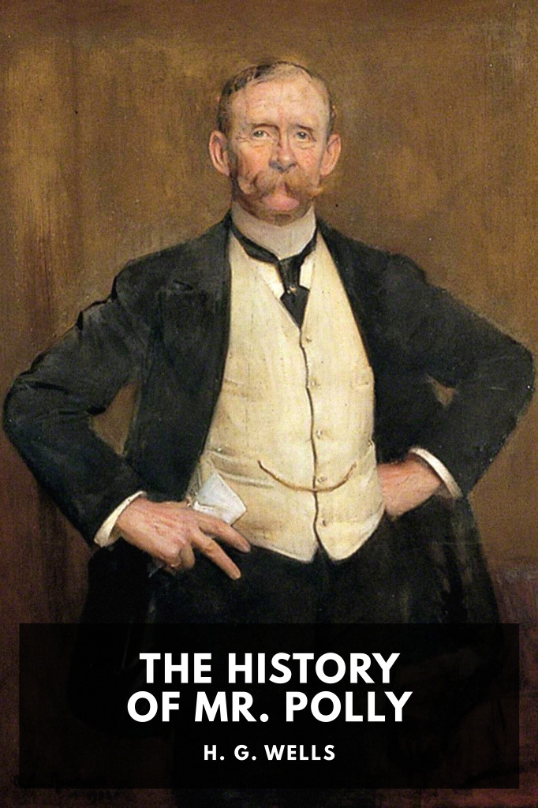

# The History of Mr. Polly <kbd>v3.3.1</kbd>

  

## Creator
H. G. Wells

## Description
A middle-aged man in early Edwardian England finds himself despairing at his failed business and marriage, and takes a drastic step to escape—with unexpected results.
