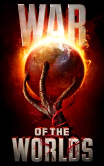

# The War Of The Worlds <kbd>v3.2.1</kbd>

  

## Creator
H. G. Wells

## Description

At the end of the nineteenth century, a metal object has fallen from the sky over the south of England, making a large hole in the ground. People came to see what it was, and surrounded the hole in great numbers. When one end of the object started to open, the watchers realized that it was a hollow. Was anybody there inside? But the creatures that have come out were not human... Slowly, people began to understand that these visitors have come from Mars. A small group of scientists and many of the other people, who have come to watch, have been killed. The second object has landed than the third, and so on. Are the Martians trying to take planet Earth, aren't they?

