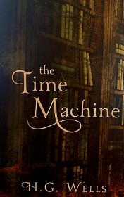

# Time Machine <kbd>v3.2.1</kbd>

  

## Creator
H. G. Wells

## Description

The story starts with a time traveller telling to his friends about geometry. He had invited his friends to the dinner where he shared his ideas with them. The time traveller is sure that the geometry they learnt at school is completely wrong. It says there are only 3 dimensions. The traveller explains to his friends that time is the fourth dimension. He uses the reading of the barometer to show it is not measuring length, width or depth. Next time the traveller showed a time machine. He has been working for two years to make it. He claims that as soon he pressed the lever, the time machine would disappear into the future. Certainly, nobody believed him. However, the traveller seriously claimed that he would go to the future with the help of his invention.

