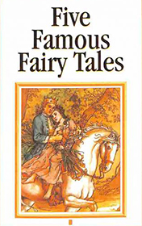

# Five Famous Fairy Tales <kbd>v3.2.1</kbd>

  

## Creator
Hans Christian Andersen

## Description
The first story tells us about a woman who had three sons. They lived in the village. The family was poor but happy. So the boys found a job. They received magical things as a salary. In the second story, you will learn about an evil queen, who had the most beautiful daughter in the world. The Queen didn't want to let her young princess get married. She just enjoyed the girl's torment. One day, a resourceful Prince appeared. The third story is about a poor man named Hans. He was happy and very cheerful until he met a witch. In the fourth story you will read about a fisherman who was poor and couldn't catch enough fish to feed his family. Once he got lucky. In the fifth story the main character is a king with ten sons and one daughter. Unfortunately his wife died. Soon a wicked stepmother came to the royal family.
