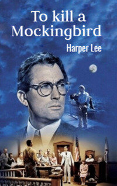

# To kill a Mockingbird <kbd>v3.3.1</kbd>

  

## Creator
Harper Lee

## Description
The first novel of the writer, which allowed her to live comfortably for many years. It belongs to the classical literature. It is also one of the best hundred novels of all times. The story begins with Simon Finch. He escaped from England due to religious persecution and settled in Alabama. Simon became rich. The main plot starts after the Great Depression in the United States. Jean Louise Finch is six years old. She lives with her father and brother. Many local children are afraid of one of the neighbours. They call him Scarecrow. At the same time, the father of Jean undertakes to defend the Negro accused of rape in court. The situation is heating up more and more. Jean and her brother are being aggressed by the local population. The court hearing is ahead. But will the honest lawyer be able to achieve success? 
