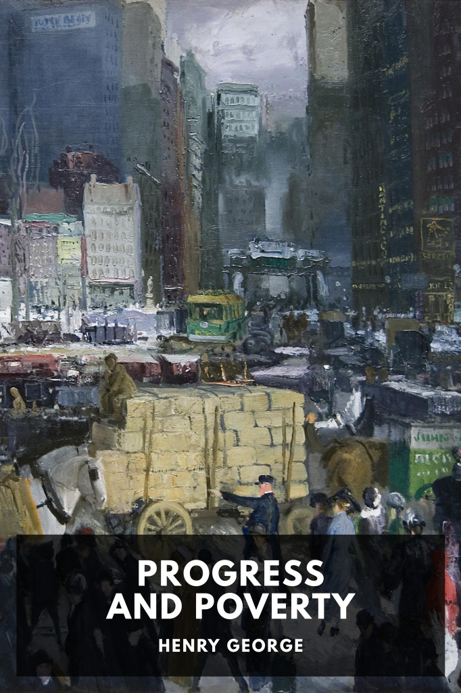

# Progress and Poverty <kbd>v3.2.1</kbd>

  

## Creator
Henry George

## Description
An explanation on why increased productivity has not led to increased wages, and how the application of a single land value tax can fix this and lead to a more just society.
