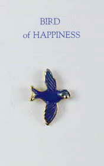

# The Bird of Happiness and Other Wise Tales <kbd>v3.3.1</kbd>

  

## Creator
Herdon Tim

## Description
This book contains eight kind and wise parables. You will find a deep meaning in simple words. These tales were created in different parts of the world: Russia, America, Burma, China, Egypt, Mexico, Guinea and India. The first story tells us about a woodcutter and his ill son. The boy asks his father to bring him a bird. It is his last desire. The next tale is about a baker, who wants to get payment even for the smell of his perfect baked goods. You will also learn about a young man who dreams to become an alchemist and make gold from dust. A Chinese old man will teach you wisdom. He always says тАЬGood luck, or bad luck who knowsтАЭ. It is true, as we never know how the things will turn out even if everything seems good. Another tale is about a man. He desires to become very rich and makes a business plan.
