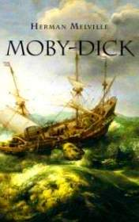

# Moby Dick <kbd>v3.2.1</kbd>

  

## Creator
Herman Melville

## Description
American sailor Ishmael goes on a voyage on a whaling ship 'Pequod', whose captain, Ahab, obsessed with revenge giant white whale, killer whale hunters known as Moby Dick. In a previous voyage, Moby Dick bit off Ahab's leg, and since then the captain uses a prosthesis. Ahab orders watch the sea constantly and promises gold coin to the one who first noticed Moby Dick. On the ship, sinister events begin to happen - Captain Ahab finally loses his mind. In the end, 'Pequod' catches up with Moby Dick.
