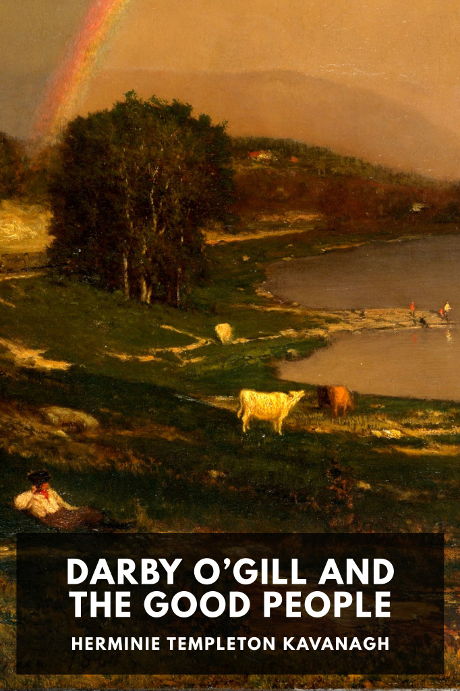

# Darby O’Gill and the Good People <kbd>v3.2.1</kbd>

  

## Creator
Herminie Templeton Kavanagh

## Description
When Tipperary man Darby O’Gill is imprisoned by the fairies of Sleive-na-mon in their home under the hollow mountain, he starts a lasting friendship with their King Brian Connors.
