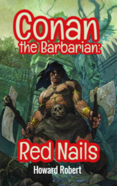

# Conan the Barbarian: Red Nails <kbd>v3.3.1</kbd>

  

## Creator
Howard Robert

## Description
Everybody has heard about the famous character of the writer Howard Robert. This character appeared in the books many years ago and became extremely popular in the twentieth century. Conan became the hero of several films, lots of animated films, comics and computer games. He was the last of the Cimmerian tribe - mighty and fearless warriors. Tall, long-haired and with tremendous physical strength - Conan had been fighting his whole conscious life since early childhood. Despite his rude disposition, Conan always adhered to some personal code of honor. This story tells about classic adventures of Conan. Here he is, quite severe and rude, fully consistent with his nickname - the Barbarian. 
