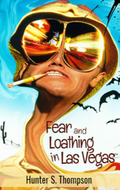

# Fear and Loathing in Las Vegas <kbd>v3.2.1</kbd>

  

## Creator
Hunter S. Thompson

## Description
'Fear and Loathing in Las Vegas' is a novel by the American journalist Hunter. S. Thompson. In 1998, this book was filmed. The film became a cult hit thanks to the actors Johnny Depp and Benicio del Toro. In 1971, journalist Raoul Duke and his attorney Dr. Gonzo are going to Las Vegas. Their job is to write an aricle about the motorcycle race. They use different drugs during the journey. That is why they both think chaos is going on around. Flocks of bats are chasing them. Vile creatures are at every step. Only a special medicine can save them. These two men do bad things: they threaten the maid, smash cars and run from the police. Sometimes it is difficult to distinguish reality from hallucinations.  
