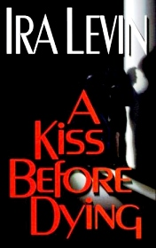

# A Kiss Before Dying <kbd>v3.2.1</kbd>

  

## Creator
Ira Levin

## Description

The young man wanted to become reach using charming girl that studied with him. Her name is Dorothy and she is a daughter of very rich man named Leo Kingship. But suddenly Dorothy became pregnant and her boyfriend realized that his plan can be ruined. He started to make new arrangements for resolving so inconvenient situation. In several days Dorothy found dead. According to suicide note that was send to Ellen, sister of dead girl, and that fact that birth certificate was found at place of dead, police decided that her death was certainly suicide. But Ellen was not so sure, she thought her sister was killed. Ellen went to city where her sister was studying at university. There she started an investigation, almost immediately she founded a man that she thinks killed her sister…

