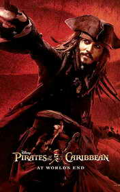

# At the World's End <kbd>v3.3.1</kbd>

  

## Creator
Irene Trimble

## Description

This is the final part of the trilogy Pirates of the Caribbean. "Do you agree to go to the end of the world and farther to bring back the handsome Jack and his Pearl?" Bravely hurling himself with a sword at the villain, Captain Jack Sparrow disappeared along with his ship in the jaws of the monster. But it is naïve to believe that the brave pirate Jack will disappear forever. After leaving the real world he found himself in a surreal reality. You will meet Will Turner again, who used to be a humble blacksmith and now he is a pirate. His beloved Elizabeth Swann made a mean act and it made Jack fell into the "eternal nowhere". What can we expect from Elizabeth after that? The answer to this question is located "At World’s End." In this part, the characters will face a common enemy. They will forget all their disagreements to defeat him.

