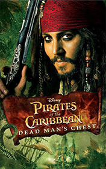

# Pirates of the Caribbean - Dead Man's Chest - Trimble <kbd>v3.2.1</kbd>

  

## Creator
Irene Trimble

## Description

In ancient times goddess Calypso lived on the Earth. She was incredibly gorgeous and owned all the waters of the planet. Her wanderings through the waters led her to a simple sailor Davy Jones. They fell in love with each other. One day Jones arranged a date with her but she didn't come. The man in love decided Calypso had betrayed him. He cut his heart out to relieve his suffering and put it into a chest. The sailor hid this chest on the unknown land. He became a bloodthirsty pirate and sailed on the ship "Flying Dutchman". He looked for the debtors. Captain Jack Sparrow became one of these debtors. Now he has to find out one hundred innocent souls in exchange for his one. These souls will be Davy Jones' slaves instead of Jack. Will Turner is an obstacle for Jack Sparrow's aim.

