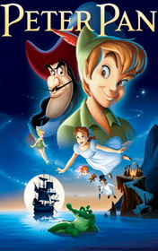

# Peter Pan <kbd>v3.2.1</kbd>

  

## Creator
J. M. Barrie

## Description

Peter Pan is one of the most popular child literature characters of the twentieth century. This is a simple and a magical story about a fairy boy, who didn’t want to grow up. Peter has run away from home, and became forever young. He lived with the company of little boys, who had lost in the forest. Once Peter Pan has flown into the nursery, where were the girl Wendy and her two younger brothers and he has changed the lives of these children forever. They went with Peter to the far miracle island called Neverland. There they’ve met with mermaids, brave Indians, playful fairy and even pirates with their evil master captain Hook. The captain Hook's fate would depend from the hands of Peter Pan, his main enemy. Exciting, romantic and dangerous adventures waiting for the heroes.

